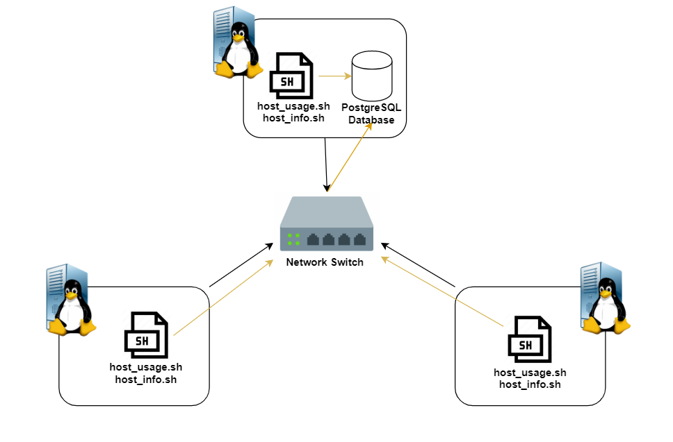

# Linux Cluster Monitoring Agent

## Introduction
The Linux Cluster Monitoring Agent is a tool that allows IT admins to retrieve hardware information about all server nodes that are internally connected within its network via ethernet switch. The data will be stored on a PostgreSQL database and can be used later to generate reports for future resource planning.

This tool is only an MVP and gives a high-level representation of how a real enterprise monitoring agent would work. 

## Architecture and Design
 

The architecture diagram above shows how the tool retrieves system hardware information. Each Linux server will contain two bash scripts `host_info` and `host_usage`, these scripts will be executed and sent to the database. The server local to the database will send the information directly, whereas the other servers will be sent via the network switch.

### Database and Tables
The PostgreSQL database, `host_agent`, consists of 2 tables, `host_info` and 
`host_usage`. 

The `host_info` table consists of information about the hardware specification of the server. The data are as follows:

- `id`: Unique identifier that corresponds to each server node (**primary key**)
- `hostname`: Unique server system name (e.g. *jrvs-remote-desktop-centos7-6*)
- `cpu_number`: Number of CPUs the respective server is running on
- `cpu_architecture`: The CPU architecture type (e.g. *x86_64*)
- `cpu_model`: The CPU model type (e.g. *Intel(R) Xeon CPU @ 2.30GHz*)
- `L2_cache`: Size of level 2 CPU cache (in kB)
- `total_mem`: Total memory of the server node (in kB)
- `timestamp`: Time when the server node was first initialized in the `host_info` table (in UTC timezone: e.g. *2019-05-29 17:49:53*)

The `host_usage` table contains information about each server's resource usage; this information is captured every minute. The data are as follows:

- `timestamp`: Time when the resource information was captured in the UTC timezone.
- `host_id`: Unique identifier that corresponds to each server (**foreign key** to `host_info`'s `id` attribute)
- `memory_free`: Total amount of space available
- `cpu_idle`: Percentage of time CPU was idle
- `cpu_kernel`: Percentage of time running kernel code
- `disk_io`: Number of disk input/output process in progress
- `disk_available`: Size of available disk space (in MB)

### Scripts Descriptions

- [psql_docker.sh](scripts/psql_docker.sh): To create, start, and stop a PSQL database in a docker container.
- [host_info.sh](scripts/host_info.sh): Ran once for every server that is connected to the network. This is to initialize the host information in the `host_info` table so that data collected in the `host_usage` table can reference from it. 
- [host_usage.sh](scripts/host_usage.sh): Collects resource usage data of the server and inserts the results into the `host_usage` table. The data is automatically inserted every minute using crontab.
- [ddl.sql](sql/ddl.sql): Creates the `host_info` and `host_usage` tables in the `host_agent` database. It also populates each table with one default data entry. 
- [queries.sql](sql/queries.sql): Runs two queries for reporting purposes.
    1) Group hosts by CPU number and sort by their memory size.
    2) Obtain average memory usage over a 5-minute interval for each host.

## Usage
**1. Initializing database and tables**
To have the monitoring agent operating, first, a PostgreSQL instance **needs** to be provisioned. This can be done by running a Docker container called `jrvs-psql`, and instantiating a PostgreSQL database in that container. Running  `psql_docker.sh` and `ddl.sql` should easily be able to set that up. 

    # Creating a docker container with a psql instance
    ./linux_sql/scripts/psql_docker.sh create [db_username] [db_password]
    
    # Starting a docker container
    ./linux_sql/scripts/psql_docker.sh start 
    
    # Creating host_info and host_usage tables
    export PGPASSWORD=[db_password] 
    psql -h localhost -U postgres -d host_agent -f sql/ddl.sql
    

**2. host_info.sh**
This script needs to be run once for each server node connected to the network. 

    ./linux_sql/scripts/host_info.sh [psql_host] [psql_port] [db_name] [psql_user] [psql_password]

**3. host_usage.sh**
This script can be used to collect the server node's resource usage data.

    ./linux_sql/scripts/host_usage.sh [psql_host] [psql_port] [db_name] [psql_user] [psql_password]

**4. setting up crontab**
By using the crontab tool, we can schedule the `host_usage.sh` script to automatically run every 1 minute.  The host usage logs will also be temporarily stored in */tmp/host_usage.log* .

    # to create a crontab job
    crontab -e
    
    # in the crontab text editor enter in this command
    * * * * * bash [path]/linux_sql/scripts/host_usage.sh [psql_host] [psql_port] [db_name] [psql_user] [psql_password]  &> /tmp/host_usage.log
    
    # to see all active crontab jobs
    crontab -l
    
    #to see temporary host_usage logs
    cat /tmp/host_usage.log

## Improvements
1. The `host_usage.sh` script does not have a way to identify which server node is currently running the script. The `host_id` number is provided manually in the script (currently set at *2*). Creating a script to fetch the `id` based on the server's `hostname` would be useful.

2. For the `host_usage` table, there isn't a limit set for many rows are inserted into the table; this may lead to load capacity errors in the future. An improvement would be to create an automatic script that can delete old records past a certain timeframe. (e.g. 2 weeks, 1 month)

3. A Docker container **needs** to be started every single time (using `psql_docker.sh`) in order for the monitoring agent to operate. This can be cumbersome, so creating a script that automatically starts the container when the server booted-up would be useful.
